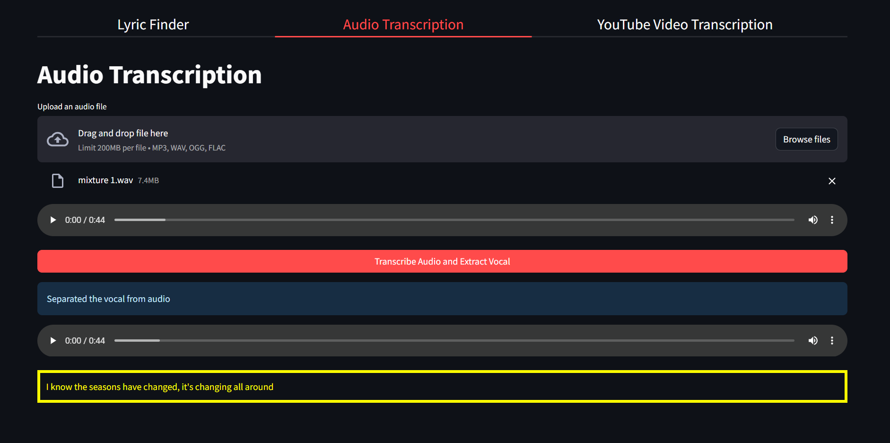

<div style="display: flex; justify-content: center; align-items: center;">

</div>


### Introduction 
MMaVVie is an app that lets you enjoy music in a new way. With MMaVVie, you can separate any song into its constituent audio parts, such as vocals, drums, bass, and other instruments. You can then listen to or download any combination of these parts, or even perform a karaoke with the lyrics displayed on the screen.

MMaVVie works by extracting audio from a source, either from YouTube or from an uploaded MP3 file. It then uses a deep learning model to automatically detect and separate the audio into four sources: vocals, drums, bass, and other instruments. You can choose which sources you want to hear or mute from the output. You can also save your customized mix as a new MP3 file.

MMaVVie also has a karaoke feature that allows you to sing along with your favourite songs. It uses OpenAI’s Whisper model for transcription and yt-dlp’s API for music extraction. You can see the lyrics of the song on the screen, and hear only the instrumental parts of the audio.

MMaVVie is a fun and innovative app that gives you more control and creativity over your music. It is composed of two parts: the frontend, which is built with Streamlit, and the backend, which is powered by FastAPI. 

### Architecture
The architecture of our application is delineated by three integral components, each playing a pivotal role within the framework. 

User Interface (Streamlit): This constituent serves as the interface through which end-users engage with our model. Users have the capability to select and separate tracks of choice, either uploaded or selected from YouTube, in addition to adjusting the pitch of a source in any desired direction. The implementation of these functionalities is facilitated through CSS embedding.

Application Programming Interface (API) - FAST API: Serving as the crucial link between the separation model and the user interface (Streamlit), the API boasts a designated "separate" endpoint. This endpoint triggers the model to perform the separation task, with the resulting components conveyed back to the user interface for consumption by end-users. This structured communication between the API and user interface ensures seamless functionality.

The Model: At the core of our architecture is the model responsible for source separation. Operating exclusively through the API, this component allows for modifications without impacting the end-user experience. This strategic design choice facilitates adaptability and scalability as needed. 


### Setup
To run the app, you need to have Python >= 3.6 installed on your system. You also need to install the dependencies listed in the requirements.txt file.

Step 1: Create a virtual environment and install the dependencies
You can use any virtual environment manager of your choice, such as venv, conda, or pipenv. For example, to create a virtual environment using venv, you can run the following command in your terminal:

`python -m venv env`

This will create a folder called env in your current directory, where the virtual environment files will be stored. To activate the virtual environment, you can run the following command:

`source env/bin/activate`

This will change your prompt to indicate that you are in the virtual environment. To install the dependencies, you can clone this repository

run the following command:

`pip install -r requirements.txt`

This will install all the packages listed in the requirements.txt file in your virtual environment.

Step 2: Launch the API
The API is built with FastAPI, a modern and fast web framework for building APIs. To launch the API, you can run the following command in your terminal:

```
cd app

uvicorn main:app --reload
```

This will start a local server on port 8000, and reload the code automatically whenever you make any changes. You can access the API documentation at http://localhost:8000/docs.


Step 3: Launch the UI
The UI is built with Streamlit, an open-source app framework for data science and machine learning. To launch the UI, you can run the following command in your terminal:

`streamlit run app/pages/main.py`

This will open a new browser window on port 8501, where you can interact with the app. You can also access the UI at http://localhost:8501.


### App Features
MMaVVie App has two main features that let you enjoy music in different ways:

`Upload and Separate Audio`: This feature allows you to add a song to the app and separate it into its sources. You can add a song in one of three ways:


-Paste a video URL from YouTube


-Search for a song on YouTube


-Drag and drop an audio file from your local machine


`Karaoke Feature`: This feature allows you to sing along with a song and see its lyrics on the screen. You can add a song in one of two ways:


-Paste a video URL from YouTube


-Drag and drop an audio file from your local machine


-Lyric Finder using the name of the song and the artist


Once the song is validated, the app will return the instrumental parts of the song and display the lyrics in real-time. You can also search for the lyrics directly if you prefer.
